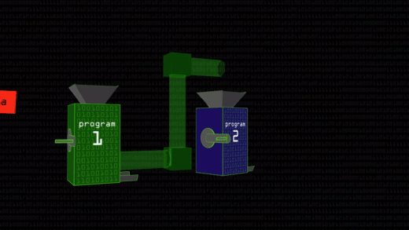

# pipex
### Recreating the UNIX "pipe" (pipeline) program

Pipe is a mechanism for connecting the output of one program to the input of another program

### Benefits of having pipes
1. Allows to have multiple small programs that are connected instead of having to write a single large program that is less flexible and limiting in its use case, meaning you can only use if for one job.
2. Back in the days, discs had 1mb or too if your were lucky, so programs were limited by the size the required to run. Having multiple smaller programs that consume less memory we could build bigger things by reusing the same memory and storing just little parts of at a time.